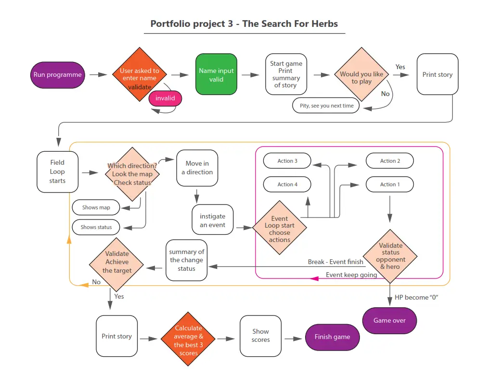
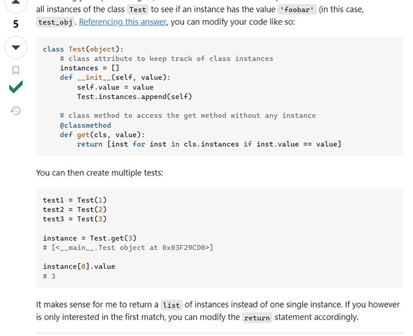

# The Search For Herbs  
  
Welcome to The Search For Herbs game.  
This is a text based adventure game that is inspired by the 80’s popular RPG game “Dragon Quest”.  
  
The hero of this game is going to collect medicinal herbs for their sick sister by running, fighting or dealing with outside of the village.   
    
## Live site
[Live site >> https://search-4-herbs-78b993bff664.herokuapp.com/](https://search-4-herbs-78b993bff664.herokuapp.com/)

# UX DESIGN  
  
## 1. Strategy Plane  
***Target users***  
1. Simply those who like to play games especially text based games.

***User value***  
1. This game is not difficult but has plenty of unexpected surprises. So any user can enjoy.
  
## 2. Scope Plane  
USER STORIES  
***First time visitor***  
* As a user, I want to clearly understand what is offered in this game.  
* As a user, I want to clearly understand how to play this game instinctively.  
* As a user, I want to see my results clearly.  

***Frequent visitor***  
* As a frequent visitor, I want to collect some rare items.
  
***The website owner stories***  
* As a site owner, I want to give users positive feelings to play games.

## 3. Structure Plane  
  
* The landing page should show what this game is offering intuitively.  
* The Code Institute gave me the template to access the game program.  
  
***Algorithm planning***  
As the planning sheet, this game's main parts are the field loop and the battle loop. So before entering the loop ask users their names, and after the game (end the loop) record the user's data to google spread sheet. 
  

# FEATURES  
  
## Existing Features  
  
**Title banner and Introduction**  
I couldn't use graphic images though I used the ASKII letters for the title banner.
Also I changed the lead paragraph to a simple short sentence to understand what this app is.

**Name Input**  
It asks the user's name. It is used for the hero's name.
Validation is set by more than 3 letters, any characters can be used but not just numbers.  

**Story Summary**  
Before this fantasy story begins, I wanted to give the user a little introduction, preparing for the fantasy setting.

**Play Input**  
This validation is asking the user to play or not. If User choose "No" then the loop stops for a while though this loop won't exit until the user types "Yes".  

**Field Loop**  
When the player goes into the field loop, the field option shows-up and asks what the player's next action is.   

**Field Option**  

**Status Window**  

**Map**  
This map uses player's location information in X, Y coordinates. I couldn't make an automatic position generator
so the Players have to find out their position by them-selves.
Also without graphics, I can't say the map's readability is fantastic though when players get used to it, it's not so bad, I think.  

## Future Features  

**Map**  
I'd like to have the function that generates the player's position on the map. That will help the player to use this map more easily.

**Heal the HP and Level Up System**  
To make this game more interesting, adding HP healing option (e.g. medicine, or magic) and adding level up system might be useful.  

# TECHNOLOGY USED  
- [Python](https://www.python.org) used for all functionality. Programming language. 
- [Gitpod](https://gitpod.io) used as a cloud-based IDE for development.
- [Git](https://git-scm.com) used for recording changes. A version control system.
- [GitHub](https://github.com) Used for our project's platformused for secure online code storage.
- [Heroku](https://www.heroku.com) Used for our project's platform. The deployed site.  

# TESTING
> I performed most of the testing myself and had some support from family members with different mobile devices.   

**Testing for visual display**  
| Visual display | Outcome  |
|--|--|
| The title logo and lead texts are printed correctly | Pass |
| Stories are printed | Pass |
| The field option box shows up | Pass |
| The map shows up | Pass |
| The status box shows up | Pass |
| The monsters status shows up | Pass |
| The battle option shows up | Pass |  

**Testing for functionality**  
| Name input validation | Outcome |
|--|--|
| Alphabets, numbers, symbols can be accepted | Pass |
| Prevent only numbers input. (No alphabet nor numbers) | Pass |
| prevent empty value to proceed | Pass |

| Start game input validation | Outcome |
|--|--|
| "Yes" "Y" "No" "N" lead to each functions | Pass |
| Prevent all the other keys, print warning. | Pass |
| prevent empty value to proceed | Pass |

| Field loop option input validation | Outcome |
|--|--|
| "Status" shows the status box | Pass |
| "Map" shows the map with location X, Y | Pass |
| "North" / "N" "South" / "S" "East" / "E" "West" / "W" | Pass |
| Prevent all the other keys, print warning. | Pass |
| prevent empty value to proceed | Pass |

|Field loop - sorting and selecting Monsters | | Outcome |
|--|--|--|
| "North" / "N" | Add counters, lead to the function | Pass |
| "South" / "S" | Add counters, lead to the function | Pass |
| "East" / "E" | Add counters, lead to the function | Pass |
| "West" / "W" | Add counters, lead to the function | Pass |
| Sort monsters by living area zones | | Pass |
| Pick up monsters randomly by weight | | Pass |

| Battle loop option input validation | Criteria | Outcome |
|--|--|--|
| "Attack"/"A" | "Monster's HP" > 0 leads continue, < 0 lead break the battle | Pass |
| "Run/"R" | Randomly success and fail | Pass |
| "Tame"/"T" | Randomly success and fail | Pass |
| "Surprise"/"S" | 3 options lead to break the battle, 1 option leads to continue | Pass |

| Recording the data and loading the best players data | Criteria | Outcome |
|--|--|--|
| Recording new data | Google spread sheet updating | Pass |
| Loading best 5 lowest moves players data | display | Pass |

| Future feature ?  | Outcome |
|--|--|
| Prevent to go outside of the map  | - |
| Find the Medicinal herb at mountain area | - |

# BUGS
## The bug in the `pick_monster` function
On the map, there are mountains, woods, fields and water areas. And depending on the zone monsters are different. To sort out monsters, I used if statement inside the `pick_monster` function. When I got this error, I completely forgot to add else statement to it. I was so lucky to find it coincidently though, I realised that I should test everything with all the options and posibilities.    
")  
Solution:  
Add `else` statement  

")

## Get instance by the variable that stores chosen instance name
Luckily, I could find the way to sort out the list of monsters which has specific value attribute smoothly. [CREDIT-> Find instance by value](#credit-ins)  
However, I needed to properly extract the chosen monster’s instance for battle function. While searching for the way, I found it might not possible to use the variable which stores monster’s name that I draw from the random pickup. Because it's not just string, it associated to specified instance. Some article says If it’s dictionary I might be able to use the variable as string keyword. So I searched how to make the dictionary from instances. And there are a lot of different ways, including using `__dict__` or `dic()` method. But this was not really successful because I didn’t really understand the class object itself. Some web pages explained that class objects have a lot of information. It became too complicated to use, there should have been a simpler way so finally I went back to the `@classmethod` to make another sort method.  
What I found from this was `Class` is "Object" so it's not that simple like variable as just stored texts.  

Solution:  
Make another `get_n` `@classmethod` 

## Refactor get instance by the variable
From the above bug report, I had two `@classmethods`. One is for randomly picking up monsters that needs only the name and the zone attributes, and the other is for handling battles. I found that my biggest mistake was that these methods were not practical at all. I thought there were two different purposes, even though they could be combined into a single method.  

Solution:  
Simplifyed to extract the instance 

## Add counter for dictionary items
When the player received items, I thought dictionary format is best though I couldn't figure it out which method is best to add items.  I tried "setdefault", "update". Those just swapped the value; couldn't count numbers.  
")  
So I looked for another way using "get" and "update" or create a method (function) inside the Class object. But when I found this page I realised that I didn't need any method, simply reassigned it.  
")  
")  

To implement this I use `try` and `except` for incase of no key exist.  
")  

Solution:  
Simply reassigned it with `try` and `except` statement  

## Title Banner
Because this project doesn't focus on graphic, I wanted to add ASCII art. However I got the error of the "SyntaxWarning: invalid escape sequence '\/'"   
I couldn't find out how to avoid this error so I changed the ASCII art to not contain any `\/`.
")  

# DEPLOYMENT  
First, we make a new repository at GitHub. But that is not really suitable for python apps to deploy there, it suits for front-end web sites. So we should make an account for Heroku service to deploy it.  

## Preparation  

***Installing additional dependencies***  
This game app is using Google sheet to save user's data.
To access Google Cloud, we need to access Google API and create a new project and enable both Google Drive and Google Sheet API. Below are the instructions from Code Institute template document.  
> The first one we need is Google-oauth which will use creds.json file to setup the authentication to access Google Cloud. The second one is gspread that we use to access and update data in the spreadsheet. These packages are included in the standard Python library, simply command `pip3 install gspread google-auth`  

Or we can install this project's requirements using:
`pip3 install requirements.txt`  
If you want to check if pip is already installed or not, you can check the installed version in the terminal:
`pip3 --version`
If it is installed, you’ll see the version information. 
Pip is a Python Package Manager.  

We need this requirements.txt file for deployment with Heroku.  
Create this `Pip3 freeze > requirements.txt` and commit this change as "Add: requirement for deployment" then push to the GitHub.  
  

***Creating Google API Credentials***  
This is how to get the credentials, based on the Code Institute template document.  
1. Access to Google Cloud, create a new project.  
2. Enable both Google Drive and Google Sheet API.  
3. Create new credentials for the new project with Editor setting.  
4. From "APIs and services", choose "Credentials", click the new mail address that has been created.  
")  
5. Choose "KEYS" from top navigations and "ADD KEY" drop dpwn.  
6. Create new key. Key type is JSON, click "CREATE". Then the credential json file is automatically down loaded.  
")  

We use these credentials to access the spread sheet though we shouldn't push this confidential file to the GitHub. To prevent this file from being added to the stage, add this file name to the ".gitignore" file and update it.  
  

***Creating the Heroku app***  
1. After we make our own account, select "New" in the top-right corner of drop down list in Dashboard page, and select "Create new app".  
")  

2. Decide the App name (it must be only lowercase letters, numbers and dashes), and then choose a region "Europe".
")  

3. Click the "Settings" to go Setting page.
")  

4. Goes to "Config Vars". 
We are using confidential credentials, so copy the contents of the credentials in json file and paste into the Config Variables. Also set the value of KEY to "PORT", and the value to "8000" then select add.
")  

5. Underneath "Config Vars" there is "Buildpacks". We will need to add two buildpacks.
(The order of the buildpacks is important)  

> 1. `heroku/python`
> 2. `heroku/nodejs`  
")  
  

## Deployment  

1. When Heroku setting is done, go to "Deploy" page.
")  

2. We are using GitHub so choose "Deployment method" "GitHub". 
And input repository's name to connect to it. 
")  

3. Underneath we can choose the options “Automatic deploys” and “Manual deploy”. I chose “Automatic deploys” but it didn’t provide me the new app’s URL. For me it worked so that it deployed automatically after I selected Manual Deploy, I did not have to click on “Automatic deploys” afterwards. 

## Forking  
>A fork is a new repository that shares code and visibility settings with the original “upstream” repository. Forks are often used to iterate on ideas or changes before they are proposed back to the upstream repository, such as in open source projects or when a user does not have write access to the upstream repository. [Quote from GitHub Docs](https://docs.github.com/en/pull-requests/collaborating-with-pull-requests/working-with-forks/fork-a-repo)  

We can make a copy of someone's original repository on our GitHub account, so we can make changes without affecting the original repository.  

1. Locate the objective repository using my Github account (I can’t fork my own repository),
top-right of the Repository (not top of page) just right hand side of the repository title, click the "Fork" Button.  
") 

2. Input available new repository name and click “Create fork”. Now there is a copy of the original repository in my own GitHub account.
") 

## Cloning

# CREDITS
## Code References

### Find instance by value
These monsters' habitats are different; some of them live in the woods, while others are in the fields or mountains. I want to sort them by their specific class attributes. To make this possible, I will use a @classmethod, as referenced in an article on Stack Overflow.  
First, save all the instances in the list and using `@classmethod` to sort out by specific value. Then, randomly pick up instances by populations' weight.    
  

## Editing and Proofreading
Since I am not a native English speaker, my family assisted me with editing and proofreading.
 [ACKNOWLEDGEMENTS](#acknowledgements)  

# ACKNOWLEDGEMENTS  

I would like to give great thanks to my mentor Alan Bushell for his exellent advice and support.  
Also my cohort facilitator Amy Richardson for all the support and assistance.  

During this project's period I needed to go back home to support my family. Kindly the Student Care team also supported and worked for me, thank you so much.

And also thanks to my family Sean Coffey and Dean Coffey for all the support.
